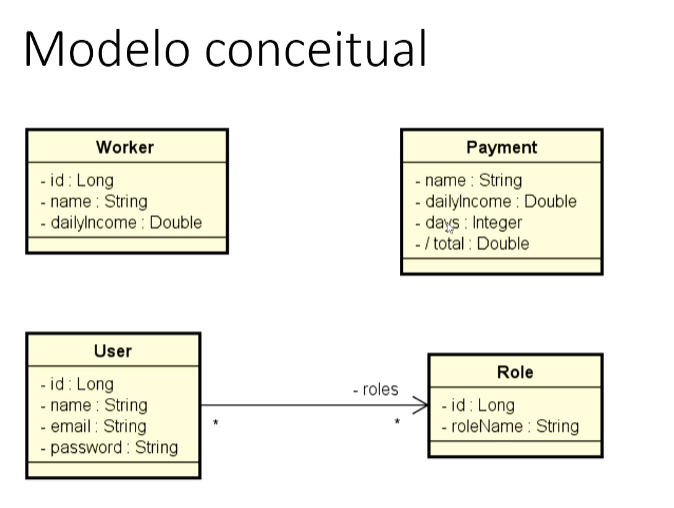
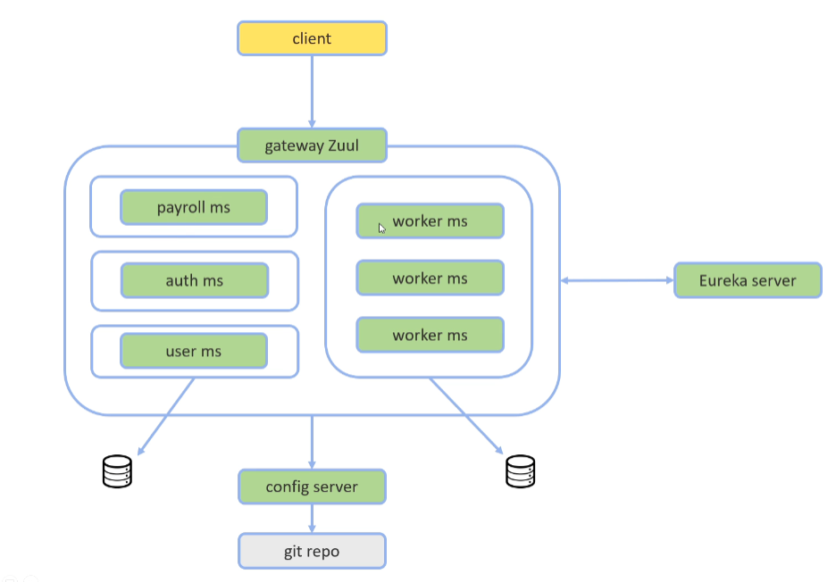

Claro, aqui está um exemplo de README.md para o seu projeto:

---

# Sistema de Microserviços com Spring

Este projeto é um exemplo prático de um sistema de microserviços desenvolvido utilizando o ecossistema Spring. Ele demonstra a arquitetura de microserviços, comunicação entre serviços, escalabilidade automática e segurança de dados utilizando OAuth e JWT.

## Visão Geral

O sistema é composto por diversos microserviços interconectados:

- **Serviço de Trabalhadores:** Responsável pelo cadastro de trabalhadores e sua escalação automática conforme necessário.
- **Serviço de Folha de Pagamento:** Utiliza os dados do serviço de trabalhadores para gerar registros de pagamento.
- **Serviço de Usuários:** Gerencia o cadastro de usuários e suas permissões.
- **Serviço de Autorização:** Implementa os protocolos OAuth e JWT para garantir a segurança dos dados.

Os microserviços se registram em um servidor de descoberta (EURECA) para facilitar a comunicação, e um API Gateway é utilizado para rotear as requisições dos clientes para os serviços apropriados.



## Funcionalidades Principais

- Cadastro, edição e exclusão de trabalhadores.
- Geração de registros de pagamento com base nos dados dos trabalhadores.
- Gerenciamento de usuários e permissões de acesso.
- Autenticação e autorização seguras utilizando OAuth e JWT.
- Escalabilidade automática dos microserviços conforme a demanda.

## Pré-requisitos

- Java Development Kit (JDK) 11 ou superior
- Maven
- Docker (opcional, para execução em contêineres)

## Como Executar

1. Clone este repositório:

```bash
git clone https://github.com/seu-usuario/sistema-microservicos-spring.git
```

2. Entre no diretório do projeto:

```bash
cd sistema-microservicos-spring
```

3. Compile o projeto:

```bash
mvn clean package
```

4. Execute os microserviços:

```bash
java -jar service-worker/target/service-worker.jar
java -jar service-payroll/target/service-payroll.jar
java -jar service-users/target/service-users.jar
java -jar service-authorization/target/service-authorization.jar
```

5. Acesse a documentação da API e endpoints através do seguinte URL:

```
http://localhost:8080/swagger-ui.html
```

## Contribuição

Contribuições são bem-vindas! Antes de abrir um problema, por favor, verifique se ele já não foi reportado. Leia o [guia de contribuição](CONTRIBUTING.md) para mais detalhes sobre como contribuir para este projeto.

## Licença

Este projeto está licenciado sob a [Licença MIT](LICENSE).

---
